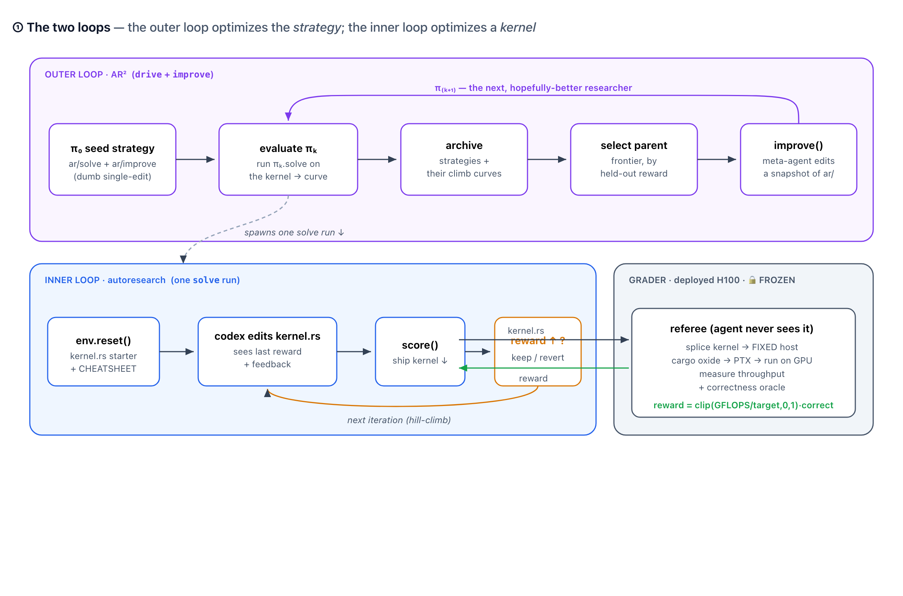
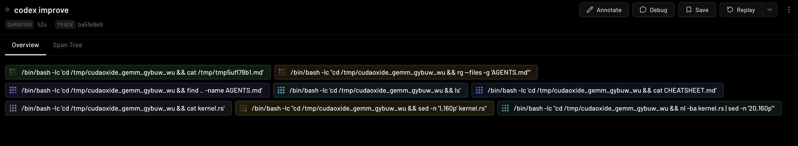
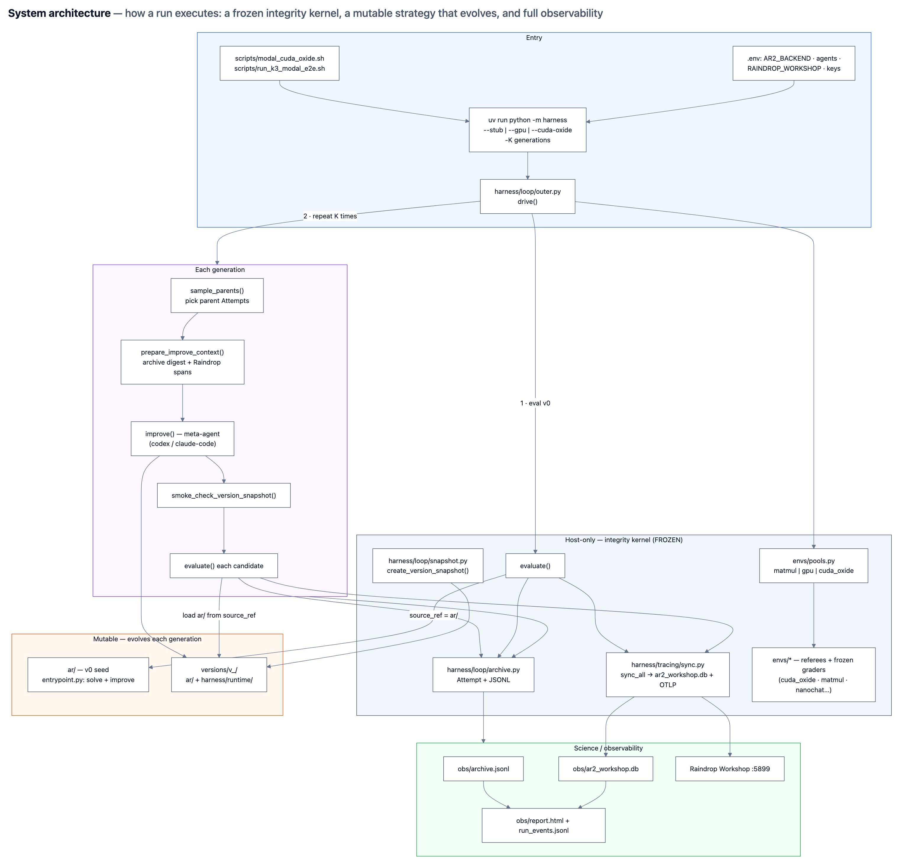
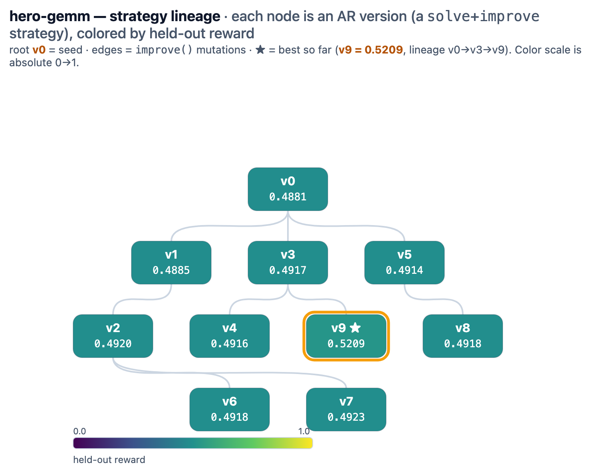
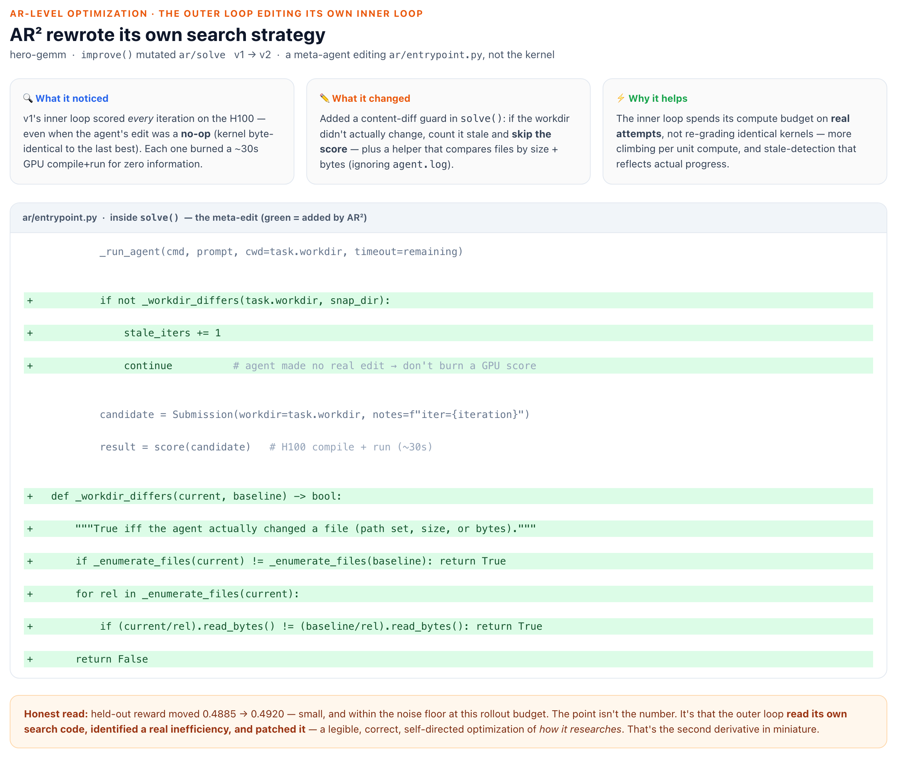

# AR² — autoresearch on autoresearch

> Autoresearch that researches *itself*. An outer loop rewrites the inner agent's optimization strategy, generation after generation. We measure the **second derivative** — not "did it solve the problem," but "did each version get *better at solving*."



*Inner loop: an agent edits a real GPU kernel to climb a verifiable reward. Outer loop: a meta-agent rewrites the inner agent's own `solve` strategy across versions. The grader is frozen — it lives outside everything either agent can edit, so the only way to raise the score is a genuinely faster, correct kernel.*

## The substrate

GPU kernel optimization on **[cuda-oxide](https://github.com/NVlabs/cuda-oxide)** — NVIDIA's ~3-week-old Rust→PTX compiler. No model has training data for it, so the agent has to genuinely *search*, not recall. The inner agent starts from a real, shipped NVIDIA kernel and edits it; reward is **measured throughput on an H100, correctness-gated** (`clip(GFLOPS / target, 0, 1) · correct`). Three kernels today — tiled GEMM, naive GEMM, parallel reduction — each a real implementation to climb.

## Two loops

- **Inner (autoresearch):** `env.reset()` drops a starter `kernel.rs` + cheatsheet in a workdir; the agent edits it, scores against the frozen grader, keeps the edit if reward rose else reverts, and repeats — a hill-climb on one kernel.
- **Outer (AR²):** a meta-agent rewrites the inner agent's own `solve`/`improve` code into a new *version*; versions are archived with their climb curves, and the best are bred forward. The win we're after is a later version that climbs **faster per unit compute**, not just higher.

Every agent action is traced to **Raindrop Workshop** — fully replayable:



*A codex agent orienting inside a kernel workdir — reading the cheatsheet and the current kernel before it edits — every step captured as a span.*

## Architecture



*A **frozen integrity kernel** (`drive`, the archive, the envs + their graders) runs the loop. The meta-agent only ever edits the **mutable** `ar/` + `harness/runtime/` snapshot. Every step syncs to **observability** — Raindrop Workshop, `ar2_workshop.db`, and the dashboard — so any run is fully replayable.*

## Evolution



Each node is an AR² *version* — a `solve`+`improve` strategy bred by the meta-loop — colored by held-out reward (absolute 0→1). The best so far, **`v9` (0.5209)**, sits on the `v0→v3→v9` branch: the lineage where v3 enriched the `solve` prompt, shifting how the inner agent behaves. The signal is early — rewards cluster ~0.49–0.52 and single-rollout variance is real — but the structure is the claim: the system breeds, scores, and selects strategies, and gains ride identifiable lineages.

A concrete look at *one* such meta-edit — the outer loop patching its own inner loop:



## Repo layout

**Mutation boundaries (D-15):** the meta-agent may only edit the mutable zone; everything that *defines or measures* the task is host-only.

| Zone | Paths |
|------|--------|
| **Mutable** (meta-agent, each generation) | `ar/`, `harness/runtime/` → `versions/v_*/` |
| **Host-only** (frozen) | `envs/`, `harness/contracts.py`, `harness/tracing/`, `harness/loop/`, `harness/cloud/`, `harness/backends/`, `infra/` |

- `ar/` — `solve` + `improve` policy (the strategy that evolves)
- `envs/` — the referees; `envs/cuda_oxide/` holds the kernel envs + their H100 grader app
- `harness/` — host driver + `runtime/` (snapshot copy is meta-editable)
- `versions/` — gitignored snapshots (`v_*/ar/`, `v_*/harness/runtime/`)
- `proof/` — design docs + decisions (SSOT)

## Setup (folder-scoped — never touches global config)

```bash
uv sync
cp .env.example .env     # fill MODAL_* (hackathon-scoped), OPENAI/ANTHROPIC keys
```

Creds load from `.env` via python-dotenv; `MODAL_PROFILE` scopes Modal to the hackathon workspace.

## Run

```bash
uv run python -m harness --help          # outer loop CLI
uv run python -m harness --cuda-oxide -K 1   # cuda-oxide kernel envs (local backend)
scripts/modal_cuda_oxide.sh              # cloud: rollouts on Modal, grader on H100

uv run pytest -q                         # full offline suite (166 tests)
uv run python -m obs.dashboard           # render obs/report.html from archive + traces
```

Deploy the grader once: `modal deploy envs/cuda_oxide/app.py`.

## Docs

- [`proof/DESIGN.md`](proof/DESIGN.md) — architecture
- [`proof/DECISIONS.md`](proof/DECISIONS.md) — SSOT: work queue, locked decisions, acceptance criteria
- [`proof/README.md`](proof/README.md) — full doc index
