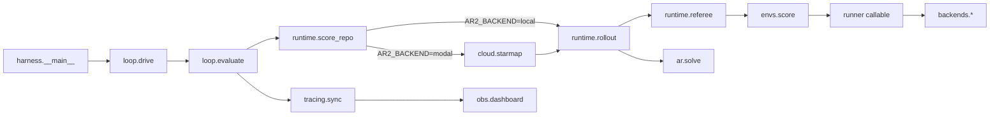

# AR² — Architecture DAG simplification (mechanical refactor)

**Status:** `IMPLEMENTED` (Part A steps 1–6, 2026-05-30)

| Doc | Role |
|-----|------|
| **`ARCHITECTURE_DAG.md`** (this file) | Approved mechanical refactor plan for import-layer cleanup |
| `DESIGN.md` | Product/architecture narrative (unchanged by this refactor) |
| `DECISIONS.md` | Feature work queue (orthogonal to this refactor) |

**Approval:** another agent (or human) marks status `APPROVED` at the top, then implementation proceeds step-by-step. Each step ends with `uv run pytest tests/ -q` green.

---

## Summary

The subpackage layout (`harness/loop/`, `runtime/`, `cloud/`, `backends/`, `tracing/`) is correct but the **import DAG still has back-edges and side-effect registration**. This plan removes those edges with **mechanical moves only** — no new features, no contract changes, no Modal/image behavior changes.

**Target:** a 5-layer DAG where each package only imports from layers below it, and **tests live next to the code they exercise** (env tests don't pull in harness orchestration).

---

## Layer model (target)

| Layer | Package | Responsibility | May import |
|-------|---------|----------------|------------|
| **L0** | `harness/contracts.py` | Types, protocols, `Archive` | stdlib, pydantic only |
| **L1** | `envs/` | Graders (`Env.score`) | L0 only |
| **L2** | `harness/runtime/` | One rollout: loader, referee, sandbox, rollout | L0, L1 |
| **L3** | `harness/backends/`, `infra/`, `harness/cloud/` | Transport + GPU compute | L0–L2, infra (never harness→infra back-edges from envs) |
| **L4** | `harness/loop/` | Meta-loop: drive, evaluate, archive | L0, L2, L5 sync hooks only (not L3) |
| **L5** | `harness/tracing/`, `obs/` | Read-only projections of Attempt/Rollout | L0 (+ tracing reads Attempt) |

**Mutable artifact:** `ar/` imports L0 only (+ optional telemetry hook removed in step 6).

---

## Target DAG (one slide)



**Invariant after refactor:** `loop/` never imports `cloud/` or `backends/`. Transport is selected only inside `runtime/score.py`.

---

## Current problems (edges to remove)

| # | Violation | Today | Fix (step) |
|---|-----------|-------|------------|
| P1 | Runtime → loop back-edge | `runtime/score.py` imports `loop/loader.py` | Move loader to `runtime/` (step 1) |
| P2 | Loop → cloud | `loop/outer.py` imports `cloud.runner`, `cloud.session` | Route through `score_repo` only (step 3) |
| P3 | Envs → harness backends | `envs/matmul.py` lazy-imports `backends.gpu` | Inject `runner=` at pool construction (step 2) |
| P4 | Side-effect Modal registration | `cloud/runner.py` does `import harness.backends.gpu  # F401` | Central `cloud/register.py` (step 4) |
| P5 | Duplicated rollout logic | `cloud/runner.run_rollout` re-implements referee/spawn/solve | Call `runtime/rollout.run_rollout_once` (step 5) |
| P6 | AR → tracing | `ar/entrypoint.py` imports `tracing.write_span` | Harness wraps score fn; remove from ar (step 6) |
| P7 | Backends → cloud session | `backends/gpu.py` imports `cloud.session` | Session stays in cloud; backends receive invoke fn or use infra only (step 4, optional split step 7) |

---

## Current layout (baseline — post subpackage move)

```
harness/
  contracts.py
  __main__.py
  loop/          outer.py, evaluate.py, archive.py, loader.py
  runtime/       score.py, rollout.py, referee.py, sandbox.py
  cloud/           runner.py, session.py
  backends/      gpu.py
  tracing/       telemetry.py, sync.py
  util/            progress.py

infra/
  modal/         images.py, secrets.py
  vast/          pool.py
  collector.py

envs/            base.py, matmul.py, nanochat.py, pools.py
obs/             dashboard.py
ar/              entrypoint.py  (mutable)
```

---

## Target layout (after all steps)

```
harness/
  contracts.py
  __main__.py
  loop/          outer.py, evaluate.py, archive.py
  runtime/       score.py, rollout.py, referee.py, sandbox.py, loader.py
  cloud/           runner.py, session.py, register.py
  backends/      gpu.py          (optional later: local.py, modal_gpu.py, vast.py)
  tracing/       telemetry.py, sync.py
  util/            progress.py

infra/           (unchanged paths)
envs/            (no harness.backends imports)
ar/              (contracts only)
```

---

## Implementation steps (mechanical, in order)

### Step 1 — Move loader to runtime (P1)

**Action:**
1. `git mv harness/loop/loader.py harness/runtime/loader.py`
2. Replace imports:
   - `harness.loop.loader` → `harness.runtime.loader`
   - Files: `runtime/score.py`, `runtime/rollout.py`, `loop/outer.py` (`_default_load_ar`)

**Acceptance:** `uv run pytest tests/ -q` green. No `runtime/*` imports from `loop/*` except via injected callables in tests.

---

### Step 2 — Inject GPU runner at pool construction (P3)

**Action:**
1. Add optional `runner=` to `MatmulEnv.__init__` (already exists — wire it explicitly).
2. In `envs/pools.py` (`gpu_matmul_pools`) and `harness/__main__.py`, build runner once:
   ```python
   from harness.backends.gpu import make_gpu_backend
   backend = make_gpu_backend()
   runner = backend.run
   MatmulEnv(..., runner=runner)
   ```
3. Remove lazy imports of `harness.backends.gpu` from `envs/matmul.py` (`_gpu_runner` / `_default_runner` use injected runner or CPU default only).

**Acceptance:** `grep -r "harness.backends" envs/` returns nothing. Matmul stub/GPU tests still pass.

---

### Step 3 — Loop must not import cloud (P2)

**Action:**
1. Remove from `loop/outer.py`:
   - `from harness.cloud.runner import run_evaluate_on_modal`
   - `from harness.cloud.session import modal_app_mode`
2. Ensure `runtime/score.py` is the **only** `AR2_BACKEND` switch:
   - `local` → `run_rollout_once` loop
   - `modal` → `cloud.runner.run_rollouts_parallel` (or `run_evaluate_on_modal` if evaluate batching stays in cloud)
3. Move `run_evaluate_on_modal` batching into `runtime/score.py` (e.g. `evaluate_train_heldout()` or extend `score_repo` kwargs). `outer.py` calls that wrapper only — no direct cloud import.
4. `modal_app_mode()` logging in `drive()` may stay via lazy import from `runtime/score.py` helper or `__main__.py` preflight — not from `loop/` → `cloud/session`.

**Acceptance:** `grep "harness.cloud" harness/loop/` returns nothing. Modal parallel tests in `test_modal_parallel.py` still pass. `AR2_MODAL_RUN_EVALUATE=1` path still batches train+heldout in one Modal parent.

---

### Step 4 — Central Modal function registration (P4)

**Action:**
1. Add `harness/cloud/register.py`:
   ```python
   """Register all Modal functions on infra.modal.images.app."""
   from infra.modal.images import app  # noqa: F401 — re-export for callers

   def register_all() -> None:
       import harness.cloud.runner  # registers run_rollout, run_evaluate
       import harness.backends.gpu  # registers _modal_gpu_run, _vast_gpu_run
   ```
2. Remove side-effect `import harness.backends.gpu  # F401` from `cloud/runner.py`.
3. Call `register_all()` from:
   - `harness/__main__.py` before deploy/run
   - Any test helper that needs registered functions (replace ad-hoc imports)

**Acceptance:** `grep "F401" harness/cloud/runner.py` gone. Modal tests pass. Single call site documents the registration DAG.

---

### Step 5 — Dedupe cloud rollout vs local rollout (P5)

**Action:**
1. Extract shared core in `runtime/rollout.py` (already has `run_rollout_once`).
2. Refactor `cloud/runner.run_rollout` to:
   - Load snapshot from volume
   - Reconstruct env from spec
   - Call `run_rollout_once(ar_dir, env, budget, inject=...)`
   - Return `rollout.model_dump()`
3. Delete duplicated referee/spawn/solve wiring inside `cloud/runner.py` (keep Modal-specific: snapshot reload, secrets, codex login, GPU env forward).

**Acceptance:** `run_rollout` body delegates to `run_rollout_once`. `test_modal_parallel.py` rollout field tests pass. Local and modal rollouts produce identical `Rollout` shapes.

---

### Step 6 — Remove tracing import from ar (P6)

**Action:**
1. Remove `from harness.tracing.telemetry import write_span` from `ar/entrypoint.py`.
2. If inner-loop span logging is still wanted, harness `runtime/rollout.py` already wraps `score()` — ensure score spans are recorded there only.

**Acceptance:** `grep "harness.tracing" ar/` returns nothing. `test_ar_entrypoint.py` passes.

---

### Step 7 (optional, deferrable) — Split `backends/gpu.py` (IMPLEMENTED)

**Action:** Split 411-line file into `backends/local.py`, `backends/modal_gpu.py`, `backends/vast.py`; thin `gpu.py` factory only.

**Acceptance:** Same public API: `make_gpu_backend()`, `GPUBackend` protocol. No import path changes for callers.

**Note:** Purely mechanical file split; can land after steps 1–6.

---

## Part B — Test colocation (IMPLEMENTED)

### Problem today

Env tests are **sprawled and coupled** across top-level `tests/`:

| File | What it actually tests | Coupling problem |
|------|------------------------|------------------|
| `tests/test_envs.py` | `envs/nanochat.py`, `envs/base.py` registry | Wrong location |
| `tests/test_e2e_matmul.py` | **4 layers** in one file | MatmulEnv unit + `drive()` + `tracing.sync` + smoke |
| `tests/test_integration.py` | harness `drive()` + `MatmulEnv` | Belongs with `harness/loop/` or stay as integration |
| `tests/test_vast_pool.py` | `infra/vast/pool.py` | Wrong location |
| `tests/test_infra.py` | `infra/modal/images.py`, collector | Wrong location |
| `tests/test_modal_parallel.py` | `harness/cloud/`, `backends/` | 616 lines, wrong location |

**Symptom:** changing `MatmulEnv` requires grep across `tests/`; env unit tests live beside harness orchestration tests.

### Rule (test layer model)

| Test location | May import | Must NOT import |
|---------------|------------|-----------------|
| `envs/test_*.py` | `harness.contracts`, stdlib, numpy | `harness.runtime`, `harness.cloud`, `harness.loop`, `tracing` |
| `harness/**/test_*.py` | layers ≤ that package | — |
| `infra/**/test_*.py` | `infra.*`, mocked `modal` | `harness.loop`, `ar` |
| `tests/` (residual) | anything — **cross-package integration only** | no env-specific unit tests |
| `smoke/` | runnable scripts (not pytest discovery) | — |

**Naming:** `test_<module>.py` colocated next to `<module>.py`.

### Target test layout

```
envs/
  test_base.py         ← registry from tests/test_envs.py
  test_nanochat.py     ← nanochat from tests/test_envs.py
  test_matmul.py       ← TestMatmulEnv from tests/test_e2e_matmul.py

harness/
  loop/test_outer.py
  runtime/test_score.py
  cloud/test_runner.py
  cloud/test_session.py
  backends/test_gpu.py   ← TestGPUBackend from test_modal_parallel
  tracing/test_sync.py   ← Raindrop + test_obs sync tests

infra/
  modal/test_images.py
  modal/test_secrets.py
  vast/test_pool.py

obs/test_dashboard.py
ar/test_entrypoint.py

tests/                   ← integration ONLY
  test_integration.py
  conftest.py
  README.md              ← one paragraph: unit tests are colocated
```

### pytest config (required for Part B)

```toml
[tool.pytest.ini_options]
pythonpath = ["."]
testpaths = ["envs", "harness", "infra", "obs", "ar", "tests"]
markers = [
    "smoke: fast no-billing end-to-end sanity checks",
    "integration: cross-package tests in tests/",
]
```

Update `Makefile` `test:` target to `pytest -q` (not `pytest tests/`).

---

### Step T1 — Colocate env tests

1. `envs/test_nanochat.py` ← nanochat tests from `tests/test_envs.py`
2. `envs/test_base.py` ← registry test from `tests/test_envs.py`
3. `envs/test_matmul.py` ← `TestMatmulEnv` + helpers from `tests/test_e2e_matmul.py`
4. Delete `tests/test_envs.py`

**Acceptance:** `pytest envs/ -q` green; env tests import only `harness.contracts`.

---

### Step T2 — Split `test_e2e_matmul.py`

1. `TestOrchestrationStub` → `harness/loop/test_outer.py`
2. `TestRaindropAggregation` → `harness/tracing/test_sync.py`
3. `test_full_e2e_offline` → `tests/test_integration.py` or new `tests/test_smoke.py`
4. Delete `tests/test_e2e_matmul.py`

---

### Step T3 — Colocate harness + obs tests

| From | To |
|------|-----|
| `tests/test_outer_loop.py` | `harness/loop/test_outer.py` |
| `tests/test_runtime.py` | `harness/runtime/test_score.py` |
| `tests/test_modal_session.py` | `harness/cloud/test_session.py` |
| `tests/test_modal_parallel.py` (GPU class) | `harness/backends/test_gpu.py` |
| `tests/test_modal_parallel.py` (rest) | `harness/cloud/test_runner.py` |
| `tests/test_obs.py` | `harness/tracing/test_telemetry.py` + `test_sync.py` |
| `tests/test_dashboard.py` | `obs/test_dashboard.py` |

Shared Modal stub → `harness/cloud/conftest.py` or `tests/conftest.py`.

---

### Step T4 — Colocate infra + ar tests

| From | To |
|------|-----|
| `tests/test_vast_pool.py` | `infra/vast/test_pool.py` |
| `tests/test_infra.py` | `infra/modal/test_images.py` |
| `tests/test_modal_secrets.py` | `infra/modal/test_secrets.py` |
| `tests/test_ar_entrypoint.py` | `ar/test_entrypoint.py` |

---

### Step T5 — Slim `tests/`

Keep only cross-package integration (`test_integration.py`, smoke wrapper). Add `tests/README.md`.

**Acceptance:** `grep -l MatmulEnv tests/*.py` hits integration files only.

---

### Step T6 — Docs

Update `README.md`, `HANDOFF.md`, `pyproject.toml` testpaths. Use `uv run pytest -q` (no Makefile).

**Implementation order:** Part A (steps 1–6) first recommended; Part B T1 can start early (env tests are independent). Part B T3–T4 should follow Part A step 3 (import path churn).

---

## Import cheat sheet (after refactor)

| Old (if any remain) | New |
|---------------------|-----|
| `harness.loop.loader` | `harness.runtime.loader` |
| `harness.cloud.*` from `loop/` | *(forbidden)* — use `runtime.score` |
| `harness.backends.*` from `envs/` | *(forbidden)* — inject at pool/CLI |
| Side-effect `import harness.backends.gpu` in runner | `cloud/register.register_all()` |

**Stable public surfaces (do not rename):**
- `harness.contracts` — SSOT types
- `python -m harness` — CLI entry
- `infra.modal.images` — Modal images + `app`
- `add_local_python_source("harness", "envs", "infra")` — unchanged

---

## Non-goals (explicitly out of scope)

- No changes to `harness/contracts.py` field definitions
- No new envs, hack_detector wiring, or dashboard features
- No Modal image layer changes (unless required by import path moves)
- No renames of `cloud/` → `modal/` (SDK name collision — stay on `cloud/`)
- No commit/push in this refactor PR unless requested

---

## Verification checklist (final)

**Part A — import DAG:**
```bash
uv run pytest -q                           # all green (after testpaths update)
grep -r "harness.backends" envs/           # empty
grep -r "harness.cloud" harness/loop/      # empty
grep -r "harness.tracing" ar/              # empty
grep "F401.*backends.gpu" harness/cloud/   # empty (side-effect import gone)
```

**Part B — test colocation:**
```bash
grep -rE "harness\.(loop|runtime|cloud)|tracing" envs/test_*.py   # empty
ls tests/test_envs.py tests/test_e2e_matmul.py 2>/dev/null          # should not exist
uv run pytest envs/ harness/ infra/ -q                            # colocated suites green
```

Optional smoke (human, billing):
```bash
MATMUL_STUB=1 uv run python -m harness --stub -K 0
AR2_BACKEND=modal AR2_GPU_BACKEND=local uv run python -m harness --stub -K 0  # if creds available
```

---

## Approval

- [x] Reviewed by: Cursor agent (architecture review, 2026-05-30)
- [x] Status set to `APPROVED`
- [ ] Implementation agent: **Part A** steps 1→6, then **Part B** steps T1→T6

**After approval:** see `DECISIONS.md` D-13 (import DAG), D-14 (test colocation).

**Verified against codebase** — all seven problems (P1–P7) match live imports:

| Problem | Confirmed location |
|---------|-------------------|
| P1 | `runtime/score.py:27`, `runtime/rollout.py:92` → `harness.loop.loader` |
| P2 | `loop/outer.py:83,182` → `harness.cloud.runner`, `harness.cloud.session` |
| P3 | `envs/matmul.py:181,187` → `harness.backends.gpu` |
| P4 | `cloud/runner.py:74` F401 side-effect import |
| P5 | `cloud/runner.py` duplicates referee/spawn/solve (vs `runtime/rollout.py`) |
| P6 | `ar/entrypoint.py:96` → `harness.tracing.telemetry` |
| P7 | `backends/gpu.py:228,347` → `harness.cloud.session` (defer to step 7) |

**Approved with constraints:**

1. **Do not touch** Modal images, `contracts.py` fields, hack_detector, or dashboard features during this refactor.
2. **Step 3 is the riskiest** — preserve `run_evaluate_on_modal` batching semantics when moving the import edge; regression target is `test_modal_parallel.py`.
3. **P7 optional** — backends→cloud session back-edge can remain until step 7; do not block steps 1–6 on it.
4. **Rollout isolation** — implementation agent may land steps 1–6 on a branch while `D-11` Modal work continues on `main`; merge after pytest green on both.
5. **L4→L5 tracing** — `evaluate()` / `drive()` calling `tracing.sync` is intentional orchestration (not a violation); layer table updated above.

**After approval:** see `DECISIONS.md` [D-13](#d-13-import-dag-mechanical-refactor).
